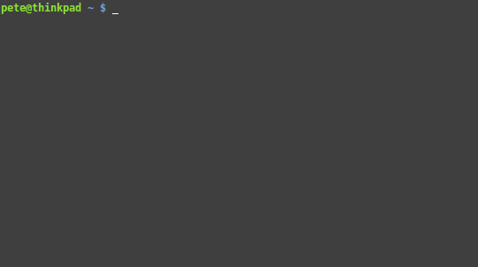

# abp

Python port of Anders and Briegel' s [method](https://arxiv.org/abs/quant-ph/0504117) for fast simulation of Clifford circuits.

Install with `pip`:

```shell
$ pip install --user abp
```



## Visualization

`abp` comes with a tool to visualize graph states in a WebGL compatible web browser (Chrome, Firefox, Safari etc). It uses a client-server architecture to enable instant updates.

First, run `abpserver` in a terminal:

```shell
$ abpserver
Listening on port 5000 for clients..
```
Then browse to `http://localhost:5001/` (in some circumstances `abp` will automatically pop a browser window).

Now, in another terminal, use `abp.fancy.GraphState` to run a Clifford circuit:

```python
>>> from abp.fancy import GraphState
>>> g = GraphState(10)
>>> g = GraphState(range(10))
>>> for i in range(10):
...     g.act_hadamard(i)
... 
>>> g.update()
>>> for i in range(9):
...     g.act_cz(i, i+1)
... 
>>> g.update()
```

And you should see a visualization of the state:


## Testing

`abp` has a fairly rigorous test suite. You can run all the tests with `nose`:

```shell
```

Currently I use some reference implementations of `CHP` and `graphsim` which you won't have installed, hence some tests will fail with `ImportErrors`. You can ignore those :feelsgood:.
