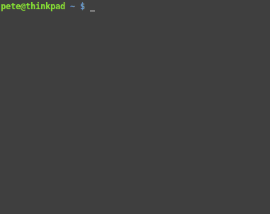
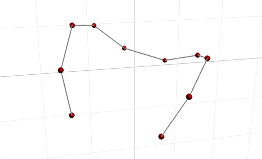

.. abp documentation master file, created by
   sphinx-quickstart on Sun Jul 24 18:12:02 2016.
   You can adapt this file completely to your liking, but it should at least
   contain the root `toctree` directive.

.. toctree::
   :maxdepth: 2

``abp``
===============================

This is the documentation for ``abp``. It's a work in progress.

``abp`` is a Python port of Anders and Briegel' s `method <https://arxiv.org/abs/quant-ph/0504117>`_ for fast simulation of Clifford circuits. 
That means that you can make quantum states of thousands of qubits, perform any sequence of Clifford operations, and measure in any of :math:`\{\sigma_x, \sigma_y, \sigma_z\}`.

Installing
----------------------------

You can install from ``pip``:

.. code-block:: bash

   $ pip install --user abp

Alternatively, clone from the `github repo <https://github.com/peteshadbolt/abp>`_ and run ``setup.py``:

.. code-block:: bash

   $ git clone https://github.com/peteshadbolt/abp
   $ cd abp
   $ python setup.py install --user

If you want to modify and test ``abp`` without having to re-install, switch into ``develop`` mode:

.. code-block:: bash

   $ python setup.py develop --user  

Quickstart
----------------------------

It's pretty easy to build a graph state, act some gates, and do measurements::

    >>> from abp import GraphState
    >>> g = GraphState(range(5))
    >>> for i in range(5):
    ...     g.act_hadamard(i)
    ... 
    >>> for i in range(4):
    ...     g.act_cz(i, i+1)
    ... 
    >>> print g 
    0:  IA	(1,)
    1:  IA	(0,2)
    2:  IA	(1,3)
    3:  IA	(2,4)
    4:  IA	(3,)
    >>> g.measure(2, "px")
    0
    >>> print g
    0:  IA	(3,)
    1:  ZC	(3,)
    2:  IA	-
    3:  ZA	(0,1,4)
    4:  IA	(3,)

Working with GraphStates
-------------------------

The ``abp.GraphState`` class is your main interface to ``abp``.  
Here follows complete documentation

.. autoclass:: abp.GraphState

    .. automethod:: abp.GraphState.__init__

    .. automethod:: abp.GraphState.add_node

    .. automethod:: abp.GraphState.add_nodes

    .. automethod:: abp.GraphState.act_local_rotation

    .. automethod:: abp.GraphState.act_hadamard

    .. automethod:: abp.GraphState.act_cz

    .. automethod:: abp.GraphState.act_circuit

    .. automethod:: abp.GraphState.measure

    .. automethod:: abp.GraphState.to_json

    .. automethod:: abp.GraphState.to_state_vector

    .. automethod:: abp.GraphState.to_stabilizer

The Clifford group
----------------------

.. automodule:: abp.clifford

|

The ``clifford`` module provides a few useful functions:

.. autofunction:: abp.clifford.use_old_cz
    :noindex:

Visualization
----------------------

``abp`` comes with a tool to visualize graph states in a WebGL compatible web browser (Chrome, Firefox, Safari etc). It uses a client-server architecture.

First, run ``abpserver`` in a terminal:

.. code-block:: bash

    $ abpserver
    Listening on port 5000 for clients..

Then browse to ``http://localhost:5001/`` (in some circumstances ``abp`` will automatically pop a browser window).

Now, in another terminal, use ``abp.fancy.GraphState`` to run a Clifford circuit::

    >>> from abp.fancy import GraphState
    >>> g = GraphState(range(10))
    >>> g.act_circuit([(i, "hadamard") for i in range(10)])
    >>> g.act_circuit([((i, i+1), "cz") for i in range(9)])
    >>> g.update()

And you should see a 3D visualization of the state. You can call ``update()`` in a loop to see an animation.

Reference
----------------------------

More detailed docs are available here:

* :ref:`genindex`
* :ref:`modindex`
* :ref:`search`

